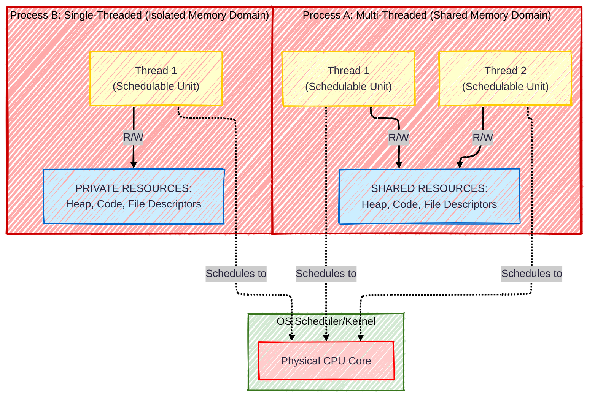
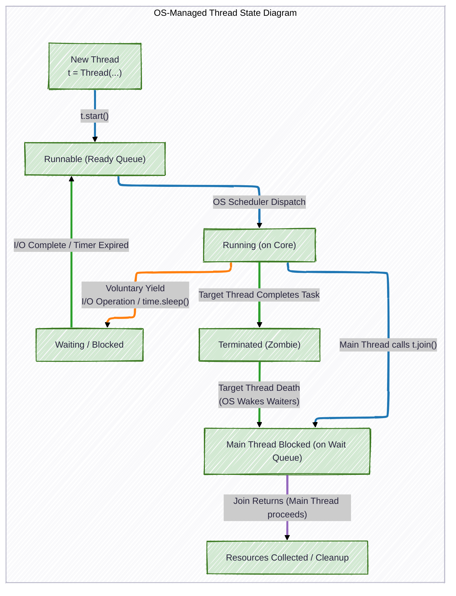

# PHASE 1. FOUNDATIONS: CONCURRENCY, THE GIL, AND THREADS


```python
import sys

sys.version
```


    '3.14.0 free-threading build (main, Nov  1 2025, 00:37:47) [GCC 14.2.0]'


# <b>1.1 Comparing Sequential vs Concurrent</b>

## pthreads - C example

### `sleep` example

Let's write a C program that creates two threads. One will print a series of letters, and the other will print a series of numbers. Because of concurrent execution, the output will be interleaved in a non-deterministic way, demonstrating the core concept.

**To Compile and Run:**

You must link the `pthread` library when compiling.

```bash
gcc -o concurrent concurrent.c -lpthread
./concurrent
```

When you run this, you will *not* see all letters then all numbers, or vice versa. You will see a mixed output like this:

```
Main: Starting threads...
Main: Threads started. Waiting for them to finish...
Number: 0
Letter: A
Number: 1
Letter: B
...
```

The exact order will change each time you run it. This is the non-deterministic scheduling of the operating system in action.

```c
#include <pthread.h>
#include <stdio.h>
#include <stdlib.h>
#include <unistd.h> // for sleep()

// A simple function that will be run in a thread.
// It takes a void* argument and returns a void*.
// This is the required signature for a thread function.
void* print_numbers(void* arg);
void* print_letters(void* arg);

int main(void)
{
    pthread_t thread1, thread2; // These are handles for our threads, like file descriptors.

    printf("Main: Starting threads...\n");

    // Create the first thread. It will run the print_numbers function.
    if (pthread_create(&thread1, NULL, print_numbers, NULL) != 0) {
        perror("Failed to create thread1");
        return 1;
    }

    // Create the second thread. It will run the print_letters function.
    if (pthread_create(&thread2, NULL, print_letters, NULL) != 0) {
        perror("Failed to create thread2");
        return 1;
    }
    
    printf("Main: Threads started. Waiting for them to finish...\n");

    // pthread_join is crucial. It makes the main thread WAIT for the other threads to finish.
    // If we didn't do this, main might exit immediately, killing the child threads.
    pthread_join(thread1, NULL);
    pthread_join(thread2, NULL);

    printf("Main: Both threads have finished.\n");
    return 0;
}

void* print_numbers(void* arg)
{
    for (int i = 0; i < 5; i++) {
        printf("Number: %d\n", i);
        sleep(1); // 1 sec
    }
    return NULL;
}
void* print_letters(void* arg)
{
    for (char c = 'a'; c <= 'e'; c++) {
        printf("Letter: %c\n", c);
        sleep(1);
    }
    return NULL;
}
```


```python
!gcc -o src/concurrent_c src/concurrent.c -lpthread
!src/concurrent_c
```

    Main: Starting threads...
    Number: 0
    Main: Threads started. Waiting for them to finish...
    Letter: a
    Number: 1
    Letter: b
    Letter: c
    Number: 2
    Number: 3
    Letter: d
    Number: 4
    Letter: e
    Main: Both threads have finished.


```python
!src/concurrent_c
```

    Main: Starting threads...
    Main: Threads started. Waiting for them to finish...
    Number: 0
    Letter: a
    Number: 1
    Letter: b
    Number: 2
    Letter: c
    Number: 3
    Letter: d
    Number: 4
    Letter: e
    Main: Both threads have finished.


**Key Concepts Illustrated:**

1.  `pthread_t`: A type for a thread "handle". It's how we reference the thread.
2.  **`pthread_create`**: The system call to create a new thread. It takes:
    *   A pointer to a `pthread_t` to store the handle.
    *   Thread attributes (we use `NULL` for defaults).
    *   The *function pointer* to the routine the thread will execute.
    *   A *single argument* to pass to that function (we use `NULL` for now).
3.  **Thread Function**: Must be of the form `void* function_name(void* arg)`. This is the independent path of execution.
4.  `pthread_join`: This is how one thread waits for another to terminate. The `main` function blocks here until `thread1` and `thread2` are done. This is vital for coordination, see an example with the commented out join commands below:

```c
#include <pthread.h>
#include <stdio.h>
#include <stdlib.h>
#include <unistd.h> // for sleep()

// A simple function that will be run in a thread.
// It takes a void* argument and returns a void*.
// This is the required signature for a thread function.
void* print_numbers(void* arg);
void* print_letters(void* arg);

int main(void)
{
    pthread_t thread1, thread2; // These are handles for our threads, like file descriptors.

    printf("Main: Starting threads...\n");

    // Create the first thread. It will run the print_numbers function.
    if (pthread_create(&thread1, NULL, print_numbers, NULL) != 0) {
        perror("Failed to create thread1");
        return 1;
    }

    // Create the second thread. It will run the print_letters function.
    if (pthread_create(&thread2, NULL, print_letters, NULL) != 0) {
        perror("Failed to create thread2");
        return 1;
    }

    printf("Main: Threads started. Waiting for them to finish...\n");

    // pthread_join is crucial. It makes the main thread WAIT for the other threads to finish.
    // If we didn't do this, main might exit immediately, killing the child threads.
    // pthread_join(thread1, NULL);
    // pthread_join(thread2, NULL);

    printf("Main: Both threads have finished.\n");
    return 0;
}

void* print_numbers(void* arg)
{
    for (int i = 0; i < 5; i++) {
        printf("Number: %d\n", i);
        sleep(1); // 1 sec
    }
    return NULL;
}
void* print_letters(void* arg)
{
    for (char c = 'a'; c <= 'e'; c++) {
        printf("Letter: %c\n", c);
        sleep(1);
    }
    return NULL;
}
```


```python
!gcc -o src/concurrent_no_join src/concurrent_no_join.c -lpthread
!src/concurrent_no_join
```

    Main: Starting threads...
    Number: 0
    Letter: a
    Main: Threads started. Waiting for them to finish...
    Main: Both threads have finished.


```python
!src/concurrent_no_join
```

    Main: Starting threads...
    Main: Threads started. Waiting for them to finish...
    Number: 0
    Letter: a
    Main: Both threads have finished.


### A Production-Level Test

We need to introduce more chaos. We'll remove the artificial synchronization of `sleep` and make the threads do *real, variable-length work* that the scheduler can't predict.

Here is a modified version of the C program. Let's call it `concurrent_chaos.c`:

> Note: We use a floating-point multiplication `x = x * 1.01;` to force the CPU to perform a series of non-trivial, repeated FPU operations, effectively ensuring it's a CPU-bound task that takes a measurable and variable amount of time.

```c
#include <pthread.h>
#include <stdio.h>
#include <stdlib.h>
#include <time.h>

// A function to simulate some "work" (a CPU-bound calculation)
// The amount of work is variable to upset any rhythm.
void do_work(int iterations);
void* print_numbers(void* arg);
void* print_letters(void* arg);

int main(void)
{
    pthread_t thread1, thread2;

    printf("Main: Starting threads...\n");

    if (pthread_create(&thread1, NULL, print_numbers, (void*)1) != 0) {
        perror("Failed to create thread1");
        return 1;
    }

    if (pthread_create(&thread2, NULL, print_letters, (void*)2) != 0) {
        perror("Failed to create thread2");
        return 1;
    }

    printf("Main: Threads started. Waiting...\n");
    pthread_join(thread1, NULL);
    pthread_join(thread2, NULL);
}

void do_work(int iterations)
{
    volatile double x = 1.0; // 'volatile' prevents compiler from optimizing the loop away

    for (int i = 0; i < iterations; i++)
        x = x * 1.01;
}

void* print_numbers(void* arg)
{
    int work_base = 1000000;
    srand(time(NULL) ^ ((long)arg + 1)); // Seed RNG uniquely for this thread

    for (int i = 0; i < 5; i++) {
        printf("Number: %d\n", i);
        int iterations = work_base + (rand() % 1000000);
        do_work(iterations);
    }
    return NULL;
}

void* print_letters(void* arg)
{
    // Let's use a variable amount of work for each step
    int work_base = 1000000;
    srand(time(NULL) ^ (long)arg); // Different seed for this thread

    for (char c = 'a'; c <= 'e'; c++) {
        printf("Letter: %c\n", c);
        // Do a random amount of work between steps
        int iterations = work_base + (rand() % 1000000);
        do_work(iterations);
    }
    return NULL;
}
```


```python
!gcc -o src/concurrent_chaos src/concurrent_chaos.c -lpthread
!src/concurrent_chaos
```

    Main: Starting threads...
    Main: Threads started. Waiting...
    Letter: a
    Number: 0
    Number: 1
    Letter: b
    Letter: c
    Number: 2
    Letter: d
    Number: 3
    Letter: e
    Number: 4
    Main: Both threads have finished.


```python
!src/concurrent_chaos
```

    Main: Starting threads...
    Number: 0
    Main: Threads started. Waiting...
    Letter: a
    Letter: b
    Number: 1
    Letter: c
    Number: 2
    Letter: d
    Number: 3
    Number: 4
    Letter: e
    Main: Both threads have finished.


**Key Changes:**
*   **Removed `sleep`:** We replaced it with a CPU-bound calculation loop (`do_work`).
*   **Introduced Randomness:** Each thread now does a variable, unpredictable amount of work between print statements. This destroys the "turn-taking" rhythm.
*   **Unique Random Seeds:** We pass a unique "argument" to each thread and use it to seed the random number generator, ensuring they don't have the same random sequence.

This is the true nature of concurrent scheduling.

## Python example

Let's now bridge this directly to Python. The `threading` module provides an object-oriented interface to these exact same OS-level pthreads.

Here is the Python equivalent of your first, more predictable C program.

Run this Python code. You will see the same kind of interleaved output. The structure is a direct mapping:
*   `pthread_create` -> `threading.Thread()` + `.start()`
*   `pthread_join` -> `.join()`


```python
import time


def print_numbers(n):
    """Print numbers."""
    for i in range(n):
        time.sleep(1)
        print(f"Number: {i}")


def print_letters(string):
    """Print letters."""
    for letter in string:
        time.sleep(1)
        print(f"Letter: {letter}")

```

### Sequential


```python
def main():
    """Run code."""
    start = time.perf_counter()

    print_numbers(5)
    print_letters("abcde")

    end = time.perf_counter()

    print(f"Time: {round(end - start, 2)}")


if __name__ == "__main__":
    main()

```

    Number: 0
    Number: 1
    Number: 2
    Number: 3
    Number: 4
    Letter: a
    Letter: b
    Letter: c
    Letter: d
    Letter: e
    Time: 10.0


### Concurrent


```python
import threading
import time


def main():
    """Run code."""
    print("Main: Starting threads...")

    start = time.perf_counter()

    t1 = threading.Thread(target=print_numbers, args=(5,))
    t2 = threading.Thread(target=print_letters, args=("abcde",))

    t1.start()
    t2.start()

    print("Main: Threads started. Waiting for them to finish...")

    t1.join()
    t2.join()

    end = time.perf_counter()

    print("Main: Both threads have finished.")
    print(f"Time: {round(end - start, 2)}")


if __name__ == "__main__":
    main()

```

    Main: Starting threads...
    Main: Threads started. Waiting for them to finish...
    Number: 0Letter: a
    
    Letter: bNumber: 1
    
    Number: 2
    Letter: c
    Number: 3
    Letter: d
    Number: 4
    Letter: e
    Main: Both threads have finished.
    Time: 5.0


```python
!python3.14 src/concurrent.py
```

    Main: Starting threads...
    Main: Threads started. Waiting for them to finish...
    Number: 0
    Letter: a
    Number: 1
    Letter: b
    Number: 2
    Letter: c
    Number: 3
    Letter: d
    Number: 4
    Letter: e
    Main: Both threads have finished.
    Time: 5.0


Now, for the crucial production-level insight. In Python 3.14t with free-threading, these `print_letters` and `print_numbers` threads can run on *different CPU cores simultaneously*. The `print` function, however, involves a shared resource: the standard output (`stdout`). The Python interpreter internally uses a lock to make `stdout` thread-safe, so you don't get garbled output like "LNumettbeer: r A: 0". This is an example of the interpreter handling one class of thread-safety for you.

# <b>1.2 Hardware level Explanation</b>

## What is a "thread"?

Let's step back and talk more about how the threads work on the hardware level. The definition "smaller units of a process" is too high level and leaves disappointment. That definition is a useless abstraction. Let's talk about the **metal**. Let's get our hands dirty with **registers**, **caches**, and **cores**.

Forget software for a moment. Imagine a single CPU core. It has:

* **Registers:** A tiny, ultrafast memory bank *inside* the CPU itself (e.g., **RIP** for the instruction pointer, RAX for a general-purpose value).
* **The ALU:** The Arithmetic Logic Unit, the part that actually does the math.
* **A Cache Hierarchy:** Small, fast memory (L1, L2) holding copies of recent data from main RAM.

A **thread of execution**, at the hardware level, is the state of that core. It is the *current values of all its registers*, especially the **Instruction Pointer (RIP)** which tells it "what line of code to run next."

### Scenario 1: A Single Core, Two Threads (The Old Way)

You have one CPU core and two software threads (like our two pthreads). The core can only be in one state at a time. It can't hold two different RIPs.

So, the OS performs **Context Switching**:

1.  The OS scheduler, a privileged piece of code, decides thread A has run long enough.
2.  It triggers an interrupt. The core stops executing your thread A's code and jumps to the OS's scheduler code.
3.  The OS *saves the entire execution state of thread A*: all register values, including RIP, are copied into a data structure in memory.
4.  The OS *loads the saved state of thread B*: it copies thread B's saved registers back into the CPU's actual registers. This includes thread B's RIP.
5.  The core resumes. But now, with thread B's state loaded, it's as if thread B was never interrupted. It continues from exactly where it left off.

This is **concurrency** but not **parallelism**. The single core is rapidly switching its state, giving the illusion of simultaneous execution. The non-determinism comes from the timing of the scheduler's interrupts (which can be based on a timer or I/O events)—**this is why your thread-unsafe code sometimes works and sometimes breaks.**

### Scenario 2: Multiple Cores, Two Threads (The Modern Reality & Python 3.14t)

You have a multi-core CPU. Now, Core 1 and Core 2 are physically distinct pieces of silicon. Each has its own registers, its own ALU, its own L1 cache.

* **Core 1** can load the state of Thread A ($RIP_A$, $registers_A$).
* **Core 2** *simultaneously* loads the state of Thread B ($RIP_B$, $registers_B$).

They now execute **in true parallel**. The electrical signals are literally flowing through two separate processor pipelines at the same time. This is the **"free-threading"** revolution in **Python 3.14t**: it allows Python threads to be scheduled onto separate cores to run in parallel, not just take turns on one core.

### The Crucial Hardware Consequence: Caches and Memory

This is where the real problems, the "production-level" issues, arise.

Each core has its own private L1/L2 cache. Main RAM is slow; caches are fast. When Core 1 reads a variable (e.g., a global counter), it gets a copy of that data into its local cache. If it increments the counter, it increments the *cached copy*.

What happens if Core 2 reads the *same* counter at the same time? It gets the *old* value from main RAM into its own cache. Now both cores have different versions of the same data. They both increment their local copies. Then they eventually write back to main RAM. One core's update will be **lost**.

**This is a Data Race.** It's not just a software bug; it's a direct consequence of the hardware memory architecture.

The solution? The CPU and OS work together. The hardware implements a **cache coherency** protocol (like MESI) and provides instructions for **atomic operations**. A **Lock** in Python, built on a **mutex** (an OS primitive), ultimately relies on these low-level CPU instructions to enforce memory synchronization and ensure only one core can execute a critical read-modify-write sequence at a time.

So, a Python thread is not an abstraction. It is a **software-managed handle for a hardware thread of execution**. When you create a Python thread, you are asking the OS to schedule a hardware state (registers, RIP) onto a physical CPU core. The chaos you observed in our C and Python experiments is the visible outcome of this hardware scheduling and cache behavior.

## What is a "process"?

The process can consist of many threads, and this is the core of modern computing. Let's break down the hardware reality of a process.

A **process** is an **allocation of resources**. A **thread** is a **stream of execution**.

So, any code that is *executing* on the machine is running within a process. A process is the operating system's unit of resource allocation.

Think of a process as a **container**. This container holds:

1.  **An Address Space:** The defined region of memory that the process can access (its code, data, heap, and stack segments).
2.  **Resources:** File descriptors, network connections, environment variables, and security attributes.
3.  **At Least One Thread of Execution:** This is the crucial part. The thread is the entity within the process that the CPU actually schedules and runs.

So, to refine the statement: "Any code running on the machine is being executed by a thread, and that thread always belongs to a process."

A simple, single-threaded program, like a "Hello, World" in C, is one process containing one thread. A multi-threaded program, like the data race example (see below), is one process containing multiple threads, all sharing the same address space and resources.

Here is a Mermaid diagram to visualize this container relationship, which is central to all modern operating systems.



This diagram shows two key ideas:
1.  **Process as a Container:** Process A has multiple threads sharing one set of resources. Process B has one thread with its own private set.
2.  **Isolation:** The memory and resources of Process A are completely isolated from those of Process B. A thread in Process A cannot directly access the memory of Process B without going through an Inter-Process Communication (IPC) mechanism provided by the OS.

### Factory example

Think of a processor-thread system like a construction company:

*   **The Process is the Company's Job Site.**
    *   It has a defined **plot of land** (its Memory Address Space). This is the "40-acre field" where it's allowed to build. No other job site can build on this land.
    *   It has **blueprints** (the executable code), stored on-site.
    *   It has **heavy equipment** (like a crane) that is shared across the site (e.g., Open Files, Sockets).
    *   This "job site" is a *resource container*.

*   **Threads are the Construction Crews working on that site.**
    *   Each crew (thread) has its own set of *hand tools* (Registers, Stack).
    *   All crews share access to the entire site: they can all use the blueprints, operate the shared crane, and bring materials from anywhere on the 40-acre plot (the shared Heap and Global memory).
    *   They are the ones *doing the work*.

### The Hardware-Level View

Let's map this to your computer's hardware:

| Component | Process (The Job Site) | Thread (A Crew) |
| :--- | :--- | :--- |
| **Memory (RAM)** | Has its own **private Memory Address Space**. A memory address (e.g., `0x7f8a1c000000`) in Process A points to a different physical chip location than the same address in Process B. The Memory Management Unit (MMU) in the CPU handles this translation. | All threads **share the same Memory Address Space** of their parent process. A global variable at address `0x55a1a2b3c4d0` is the *same physical memory* for all threads in the process. |
| **CPU Registers** | A process doesn't "have" registers directly. | **Each thread has its own COMPLETE, INDEPENDENT set of CPU registers** (RAX, RBX, RIP, RSP, etc.). This is its "hardware state." When a thread is scheduled onto a core, its registers are loaded. |
| **Stack** | The process has a main stack, but... | **Each thread gets its own, separate stack memory** (inside the process's address space). This is where local function variables, return addresses, and function parameters live. This is critical so that threads can call functions without trampling each other. |
| **Heap & Globals** | The process owns one heap. | **All threads share the same heap and global variables.** This is why data races happen: two threads on two different cores can be manipulating the same data structure in the same heap memory at the same time. |
| **OS Resources** | The process holds file descriptors, network sockets, etc. | Threads share these resources. One thread can open a file, and another thread in the same process can read from it. |

### The Concrete Hardware Sequence

Let's imagine Process P has two threads, T1 and T2.

1.  **Process P is Created:** The OS allocates a range of physical RAM for its address space, loads the code from disk into that RAM, and sets up initial data structures.

2.  **Thread T1 is Created:** The OS allocates a new, small memory region *within Process P's address space* for T1's **stack**. It then creates a data structure (a Thread Control Block) where it will save T1's **hardware state** (its registers).

3.  **Thread T2 is Created:** The OS does the same: a new stack for T2 within P's memory, and a new Thread Control Block for T2's state.

4.  **Scheduling:** The OS scheduler looks at T1 and T2 as independent, schedulable entities. It can choose to:
    *   Put T1 on Core 1 and T2 on Core 2 (**True Parallelism**).
    *   Time-slice T1 and T2 on a single core (**Concurrent Switching**).

5.  **Execution on Core 1 (T1):**
    *   The CPU's MMU is configured to point to Process P's memory map.
    *   Core 1's registers are loaded from T1's saved state. The **Instruction Pointer (RIP)** now points to T1's next line of code. The **Stack Pointer (RSP)** points to T1's private stack.
    *   Core 1 executes. It fetches instructions and data from P's memory using T1's RIP. It uses T1's stack for function calls.

6.  **Execution on Core 2 (T2):**
    *   The CPU's MMU on Core 2 is *also* configured to point to the *same* Process P memory map.
    *   Core 2's registers are loaded from T2's saved state. It has a **different RIP** and a **different RSP**.
    *   Core 2 executes completely independently, but it's reading and writing to the *same shared heap memory* as Core 1.

This is the fundamental difference. **Processes are isolated memory domains. Threads are cooperative execution units within a single memory domain.**

This is also why creating a process is "heavy" (you have to allocate a whole new address space) and a thread is "light" (you just need a new stack and a register set). And most importantly, it's why threads are so dangerous and powerful: they share everything by default, so communication is cheap, but you have no protection from each other's mistakes. A wild pointer in one thread can corrupt memory for all its sibling threads.

## How the final code is read and executed?

We write:

```python
    t1.start()
    t2.start()

    print("Main: Threads started. Waiting for them to finish...")

    t1.join()
    t2.join()
```

So, how are these commands sent to the cores of CPU? One by one as we wrote them?

Another fantastic question that cuts to the heart of the matter. You're thinking like a compiler and a CPU architect now.

The answer is **no, they are not sent to the cores one-by-one as written.** The sequence you see in your code is a **logical sequence for the main thread**, not a physical command sequence to the CPU.

Let's trace the hardware-level story of what happens. We'll follow the **Instruction Pointer (RIP)** of your main thread.

### The Main Thread's To-Do List

**File: `concurrent_example.py`**

```python
import threading
import time

# ... function definitions ...

if __name__ == "__main__":
    print("Main: Starting threads...")  # <-- RIP is here (1)
```

1.  Your main thread is running on, let's say, **Core 1**. Its RIP is moving through your `main` code.

<!-- end list -->

```python
    thread1 = threading.Thread(target=print_letters) # <-- RIP is here (2)
    thread2 = threading.Thread(target=print_numbers) # <-- RIP is here (3)
```

2.  & 3. These are just object constructions in memory. No OS thread exists yet. This is all happening sequentially in the main thread on **Core 1**.

<!-- end list -->

```python
    thread1.start()  # <-- RIP is here (4). THIS IS THE CRITICAL MOMENT.
```

4.  `thread1.start()` is a function call that culminates in a **system call** (like `pthread_create`).
      * The main thread's RIP is executing this on **Core 1**.
      * The system call causes the CPU to temporarily switch from **User Mode** to **Kernel Mode** to process the request.
      * The OS receives the request, allocates a new stack for T1, and creates a Thread Control Block.
      * The OS scheduler now has a new, schedulable entity: **T1**. It might immediately schedule T1 onto an idle core (e.g., **Core 2**), or mark it as ready-to-run.
      * **The `start()` function returns immediately.** The main thread's RIP on **Core 1** moves to the next line. It does **NOT** wait for T1 to actually start executing.

<!-- end list -->

```python
    thread2.start()  # <-- RIP is here (5)
```

5.  The exact same, immediate sequence happens for T2. T2 is now available for scheduling, perhaps on **Core 3**. The `start()` call returns immediately.

<!-- end list -->

```python
    print("Main: Threads started. Waiting for them to finish...") # <-- RIP is here (6)
```

6.  The main thread on **Core 1** executes this `print`. Meanwhile, T1 on Core 2 and T2 on Core 3 are now running **concurrently and in parallel**. The main thread's output might appear *before, after, or interleaved with* the output from T1 and T2. This is the source of **non-determinism**.

### Synchronization: The Blocking Barrier

```python
    t1.join()  # <-- RIP is here (7). ANOTHER CRITICAL MOMENT.
```

7.  `t1.join()` is another function call, but this is a **blocking system call**.
      * The main thread, on **Core 1**, tells the OS: "My instruction pointer must not proceed past this point until thread T1 has terminated."
      * The OS enters Kernel Mode, finds the main thread, and changes its state from *Running* to *Waiting*.
      * The OS de-schedules the main thread, typically placing it on a **wait queue** associated with the Thread Control Block of T1.
      * **Core 1 is now free** and is immediately offered to the scheduler to run another ready thread.
      * The main thread's RIP is **frozen**.

<!-- end list -->

```python
    t2.join()  # <-- Once T1 dies, the OS wakes up the main thread and its RIP moves here (8).
```

8.  When T1 finishes, the OS removes the main thread from the wait queue and places it back on the **ready queue**. The main thread is eventually scheduled back onto a core (not necessarily Core 1) and its RIP proceeds to `t2.join()`. The same blocking sequence happens until T2 terminates.

### The Key Takeaways

  * `start()` is a **fire-and-forget command**. It immediately returns control and creates an independent execution stream.
  * `join()` is a **synchronization barrier**. It forces the executing thread to stop and wait for another thread's state change (its death), freeing up the CPU core for productive work in the meantime.
  * **Your single stream of instructions (the main thread) is orchestrating the creation of other, independent streams.** The lines of code are executed sequentially *by the main thread*, but their *effect* is to create chaos and parallelism.

The sequence in the file is the main thread's to-do list, not a script being broadcast to the cores. The cores are all independently chewing through the instructions of their assigned threads, which is why we need primitives like `join()` to impose order on the chaos.

# <b>1.3 Python's `threading.Thread` API</b>

Now that we have a robust mental model of threads at the hardware level, the Python API will make much more sense. It's not just syntax; it's an interface for managing those independent streams of execution we just discussed.

## Thread Lifecycle

Let's break down the **Thread Lifecycle** using the API. A thread can be in one of several states, and the `threading` module gives you the tools to manage the transitions.

Here is a conceptual diagram of the lifecycle:



> Fig. 1 "OS-Managed Thread State Transitions"

And here is how the Python `threading` API maps to this lifecycle:

| Lifecycle State | Python `threading` API Trigger |
| :--- | :--- |
| **New** | `thread = threading.Thread(target=my_function)` |
| **Runnable** | `thread.start()` |
| **Running** | (Controlled by the OS Scheduler) |
| **Waiting/Blocked** | `time.sleep()`, `lock.acquire()` (on a held lock), I/O operations. |
| **Terminated** | `target` function returns or raises an exception. |
| **Main Thread Synchronization** | `thread.join()` - Main thread waits for this thread to terminate. |

Two critical, production-relevant details:

**1. The "Zombie" State (Terminated):** When a thread's `target` function returns or raises an unhandled exception, the thread enters a "Terminated" state (often called a **Zombie** state, mirroring the concept from processes). Its execution has ceased, but its control data — specifically the **Thread Control Block (TCB)** and the thread's exit status/return value — are still held by the Operating System or Interpreter. The thread is not truly de-allocated until a successful call to **`thread.join()`** occurs. The `join()` call's primary function is to **harvest** this exit status and **free the TCB resources**, which is a crucial detail for preventing **resource leaks** in long-running programs that spawn many short-lived threads. Failing to explicitly join a thread means its resource block is held indefinitely until the process exits, which can lead to system resource exhaustion (known as a **resource leak**) in long-running applications that spawn many short-lived threads.

2.  **The "Wait Queue":** The `t.join()` call does not simply make the main thread "sleep." It places the main thread on a specific **wait queue** for that terminating thread. When the target thread finally dies, the OS/Interpreter explicitly wakes up *all threads* that are waiting in that queue. This is a much more accurate description of the synchronization mechanism.

It explains *why* `join` works and what's happening under the hood. In a complex, long-running server application, understanding that threads pass through a "Zombie" state before cleanup can be important for diagnosing resource leaks.

## My turn - Main thread as a Supervisor

Your mission is to write a Python program that brings this lifecycle diagram to life. Use the `threading.Thread` API to create, start, and monitor a `worker` thread from your `main` thread.

Here is the specific task again, for clarity:

1.  Create a worker thread that runs a function which loops 5 times.
2.  In each iteration, the function should print its state (e.g., "Worker: Loop 1") and then sleep for a short, fixed period (e.g., 0.5 seconds).
3.  In your main thread, *after starting the worker thread*, use a separate loop that also runs 5 times.
4.  In each iteration of the *main* thread's loop, print "Main: Check X" and then use `thread.is_alive()` to check on the worker thread's status, printing the result.

This will demonstrate the `New -> Runnable -> Running -> Waiting -> Terminated` lifecycle and show you how the main thread can supervise another thread's state.

Let's be precise. You should create **only one new thread** within the main function.

So, you will have a total of **two threads**:
1.  The **Main Thread**: This is the one that starts when you run `python your_script.py`. It is automatically created by the Python interpreter and runs the code inside `if __name__ == "__main__":`.
2.  The **Worker Thread**: This is the one you will explicitly create with `threading.Thread(...)` and `thread.start()`.

The orchestration works as follows:

*   The **Main Thread** will:
    1.  Create and start the Worker Thread.
    2.  Then, it will execute its own 5-iteration loop, where it prints and checks on the Worker Thread.

*   The **Worker Thread** will:
    1.  Independently execute its own 5-iteration loop, where it prints and sleeps.

This setup will clearly show the two threads running their separate loops concurrently, and it allows the Main Thread to act as a supervisor for the Worker Thread.

So, to be perfectly clear: you are writing code for **two threads total**. You are only explicitly creating **one new thread**. The main thread is your starting point.


```python
import threading
import time


def main():
    """Run code."""
    print("Main: Start.")

    # Run worker thread
    worker_thread = threading.Thread(target=worker_loop, args=(5,))
    worker_thread.start()

    for i in range(5):
        print("Main: Check", i)
        if worker_thread.is_alive():
            print("Main: Worker thread is alive")
        time.sleep(0.5)

    worker_thread.join()

    print("Main: Done.")


def worker_loop(n):
    """Run worker thread."""
    for i in range(n):
        print("Worker:", i)
        time.sleep(0.5)


if __name__ == "__main__":
    main()
```

    Main: Start.
    Worker: 0
    Main: Check 0
    Main: Worker thread is alive
    Worker:Main: Check 1
    Main: Worker thread is alive
     1
    Main: CheckWorker:  2
    2
    Main: Worker thread is alive
    Worker: 3
    Main: Check 3
    Main: Worker thread is alive
    Worker:Main: Check  44
    
    Main: Worker thread is alive
    Main: Done.


```python
!python3.14t src/check_thread.py
```

    Main: Start.
    Main: Check 0
    Main: Worker thread is alive
    Worker: 0
    Main: Check 1
    Main: Worker thread is alive
    Worker: 1
    Main: Check 2
    Main: Worker thread is alive
    Worker: 2
    Main: Check 3
    Main: Worker thread is alive
    Worker: 3
    Main: Check 4
    Main: Worker thread is alive
    Worker: 4
    Main: Done.


You have successfully demonstrated true concurrent execution. Let's analyze what this output tells us:

1.  **Immediate Concurrency:** The main thread starts, creates the worker thread, and prints "Main: Check 0". Almost simultaneously, the worker thread starts and prints "Worker: 0". The OS scheduler is immediately letting them interleave.

2.  **Non-deterministic Interleaving:** The order is chaotic. Sometimes a "Main" print comes first, sometimes a "Worker" print comes first. This is the hardware-level scheduling in action, exactly as we discussed.

3.  **Continuous Liveness:** The main thread correctly reports "Main: Worker thread is alive" on every check. The worker thread is performing its work in the "Running"/"Waiting" states throughout the main thread's loop.

4.  **Successful Supervision:** The main thread is effectively acting as a supervisor, periodically polling the health of the worker thread while doing its own work — a fundamental production pattern.

You have now practically applied the core concepts:
*   Creating a thread with `threading.Thread(target=func, args=...)`
*   Starting it with `.start()` to make it "Runnable."
*   Using `.is_alive()` to check its state from another thread.
*   Using `.join()` to wait for its "Terminated" state.

# <b>1.4 Managing Shared State</b>

## Data Race

**What happens when threads need to share and modify data, not just print to the screen?**

We are going to deliberately create a bug that is infamous in production systems: a **data race**.

Here is your next mission. We will write a program with a shared global counter that multiple threads will try to increment.

**Your Task:**

1.  Create a global variable: `counter = 0`
2.  Create a function that loops `N` times (e.g., 100,000), and in each iteration, it reads the global counter, adds 1 to it, and writes it back.
3.  Create **two threads** that both run this function.
4.  Start both threads and wait for them to finish with `.join()`.
5.  Print the final value of `counter`.

If the threads ran perfectly sequentially, the final count should be `2 * N` (e.g., 200,000).

**The Critical Question:** What do you *predict* the actual final value will be, and why?


```python
import threading


def main():
    """Run code."""
    counter = 0
    n = 100_000

    def increment_counter(n: int):
        """Increment the global global variable."""
        nonlocal counter
        for i in range(n):
            counter += 1

    print("Counter:", counter)

    thread1 = threading.Thread(target=increment_counter, args=(n,))
    thread2 = threading.Thread(target=increment_counter, args=(n,))

    thread1.start()
    thread2.start()

    thread1.join()
    thread2.join()

    print("Counter:", counter)


if __name__ == "__main__":
    main()
```

    Counter: 0
    Counter: 182004


```python
!python3.14t src/data_race_bug.py
```

    Counter: 0
    Counter: 196475


```python
!python3.14t src/data_race_bug.py
```

    Counter: 0
    Counter: 121472


Perfect! You have successfully created and observed a **severe data race** in the wild. This is **Lost Update**, a classic symptom of a data race:

*   **Thread A** on Core 1 reads `counter` (value: 100) into its CPU cache.
*   **Thread B** on Core 2 *also* reads `counter` (value: 100) into its CPU cache.
*   Both cores increment their *local, cached copy* to 101.
*   Both cores write the value 101 back to main memory.

Considering your code implementation, the `nonlocal` keyword allows the inner function to *bind* to the variable in the enclosing scope. It does **not** make the increment operation (`counter += 1`) atomic. This operation is conceptually three steps:

1.  **READ** the current value of `counter` into a CPU register.
2.  **INCREMENT** the value in the register.
3.  **WRITE** the new value back to `counter`.

The data race occurs when these steps interleave between two threads on different cores. Your result is concrete proof that this interleaving happened frequently.

## Lock

You have now moved from understanding concurrency in theory to witnessing its most dangerous practical flaw. The question now is: **How do we fix this?**

The solution is to make the read-modify-write sequence **atomic** (indivisible). We do this with a **synchronization primitive**. The most fundamental one is a **Lock** (a mutex).

Your next task is to fix this program. Use a `threading.Lock` to protect the critical section (the `counter += 1` operation).

The pattern looks like this:
```python
lock = threading.Lock()

def increment_counter(n: int):
    nonlocal counter
    for i in range(n):
        with lock:
            counter += 1
```


```python
import threading


def main():
    """Run code."""
    counter = 0
    n = 100_000

    lock = threading.Lock()

    def increment_counter(n: int):
        """Increment the global global variable."""
        nonlocal counter
        for i in range(n):
            with lock:
                counter += 1

    print("Counter:", counter)

    thread1 = threading.Thread(target=increment_counter, args=(n,))
    thread2 = threading.Thread(target=increment_counter, args=(n,))

    thread1.start()
    thread2.start()

    thread1.join()
    thread2.join()

    print("Counter:", counter)


if __name__ == "__main__":
    main()
```

    Counter: 0
    Counter: 200000


```python
!python3.14t src/data_race_lock.py
```

    Counter: 0
    Counter: 200000


**The `with lock:` Statement** ([source](https://docs.python.org/3/library/threading.html#with-locks))  
This is a context manager that ensures:
1.  `lock.acquire()` is called at the start of the block.
2.  The critical section (`counter += 1`) executes.
3.  `lock.release()` is called at the end, even if an exception occurs.

This is the **correct, robust way** to use locks, preventing resource leaks from forgotten releases.

**The Performance Trade-off**  
You have now serialized the increment operations. Only one thread can be in the `with lock:` block at a time. While this guarantees correctness, it eliminates the parallelism for this specific task. The threaded version with a lock might even be slower than a single-threaded version due to the overhead of lock acquisition.


```python
!python3.14t src/data_race_time_comparison.py
```

    Mean time spent:
    	Bug:	0.0187
    	Lock:	0.0727
    Lock is slower in 3.88 times.
    Number of tests: 100


This illustrates a core architectural principle: **Use fine-grained locks for small critical sections to maximize parallel throughput.**

You have now crossed a major threshold. You can:
1.  Identify a shared resource that needs protection.
2.  Create a data race.
3.  Use a lock to enforce mutual exclusion and ensure correctness.

# <b>Conclusion</b>

Let's consolidate what we *have* concretely accomplished in this session:

1.  **Bridged C and Python:** You wrote and understood a concurrent C program with pthreads, then mapped those concepts directly to Python's `threading` module.
2.  **Grounded in Hardware:** We moved beyond vague definitions to a concrete model of threads as independent CPU core states (registers, RIP, RSP) and processes as memory address spaces.
3.  **Witnessed a Data Race:** You wrote a program that produced a severe, measurable data race, losing over 22,000 increments.
4.  **Applied a Fix:** You correctly used a `threading.Lock` within a `with` statement to make the operation atomic and eliminate the race condition, guaranteeing correctness.

These are not small things. You have moved from abstract theory to practical, demonstrable implementation of the most critical concurrency concepts.

We will proceed at a pace you are comfortable with. The next session will focus on deepening this understanding with more practice and exploring the trade-offs we've just begun to touch upon.

# <b>Reading</b>

1.  **Python `threading` Module Documentation:** The official docs are the definitive source. Pay close attention to the `Lock` and `RLock` objects. [https://docs.python.org/3/library/threading.html](https://docs.python.org/3/library/threading.html)

2.  **Article: "Python Threading Synchronization Locks" (Real Python):** A practical, in-depth tutorial that expands on what we covered, with clear examples. [https://realpython.com/intro-to-python-threading/#using-locks-for-synchronization](https://realpython.com/intro-to-python-threading/#using-locks-for-synchronization)

3.  **Book: "The Linux Programming Interface" by Michael Kerrisk:** While not Python-specific, Chapter 29-33 provide the ultimate deep dive into Pthreads and synchronization primitives at the OS level. This will cement the hardware/OS model we discussed.

4.  **Video: "What is a Mutex in C? (pthread_mutex)" by Jacob Sorber:** A short, excellent video explaining the C mutex, which is the direct ancestor of Python's `Lock`. Watching this will reinforce the cross-language concept. [https://www.youtube.com/watch?v=oq29KUy29iQ](https://www.youtube.com/watch?v=oq29KUy29iQ)
